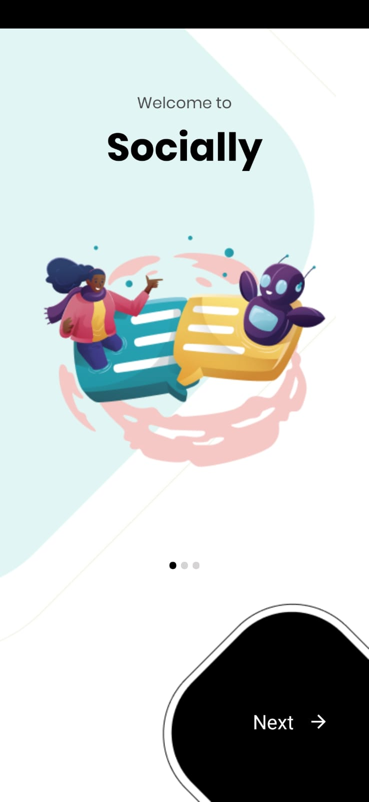
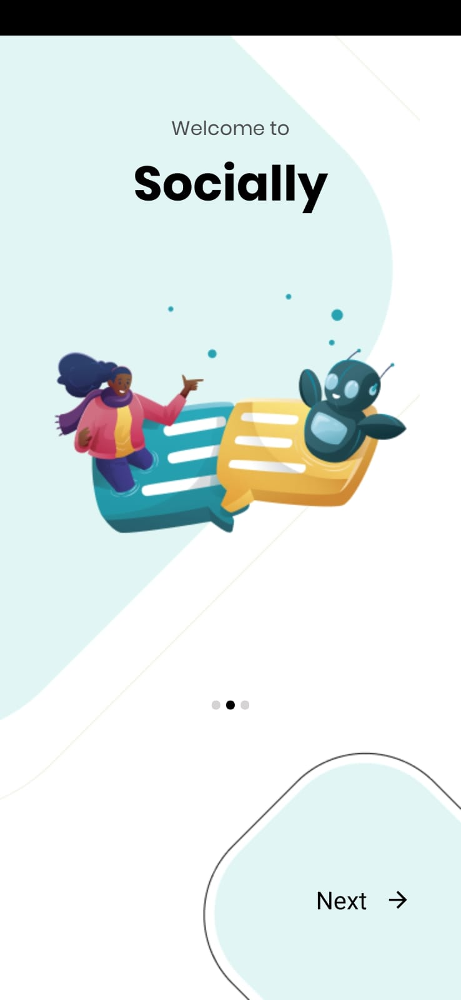
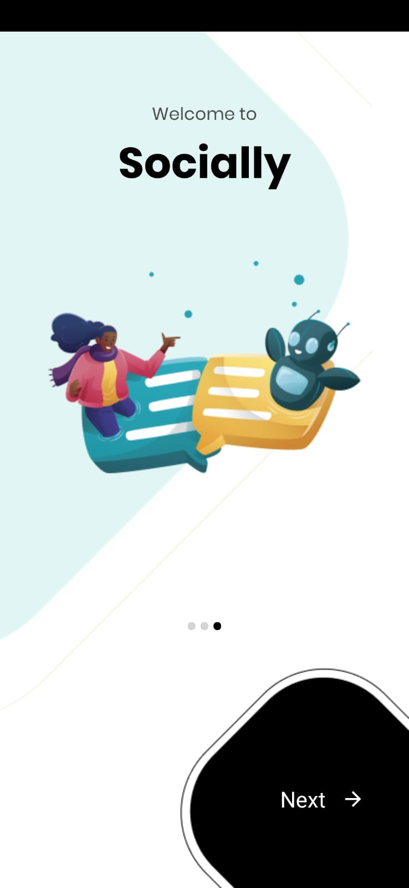
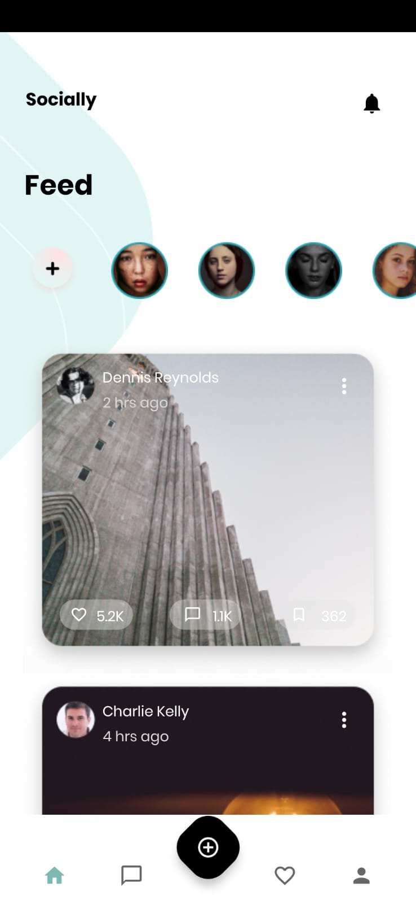
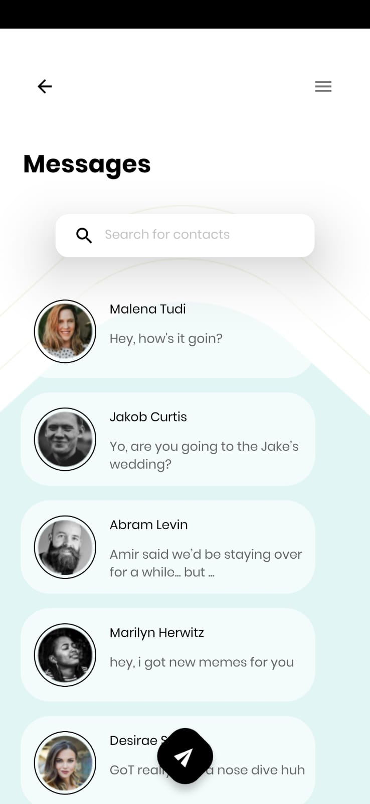
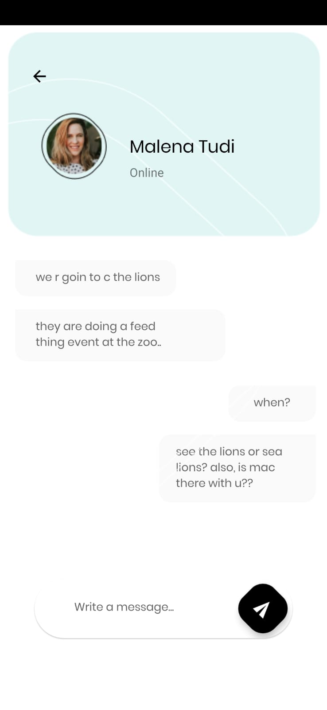
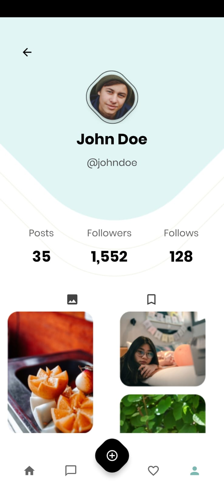

# socially

### Project Information

- This is a kind of social media app.

- It includes 3 intro pages on first run. 

- At the bottom there is a bottom navigation with a floating action button.

- Main page shows stories and posts.

- The message page lists the messages and the desired message can be accessed by searching by contact name or message content.

- By clicking on the message on the message page, all messages from the relevant person can be accessed and a new message can be written to that person.

- On the profile page, we can see the person's information and the number of posts, followers and follows, and the posts they share.

### Techs.

-Firebase
  - Crashlytics
  - Analytics
 
-SharedPreferences

-Recyclerview-Cardview

-CoordinatorLayout-Bottom Navigation-FAB

-RecyclerView with different size cardview. 

 
<a id="raw-url" href="https://raw.githubusercontent.com/SefaKoyuncu/socially/mastersocially.apk">Download APK Here</a>

------------
#### Screenshots
  
<table>
  <tr>
    <td></td>
    <td></td>
    <td></td>
  </tr>
 </table>
 
  

<table>
  <tr>
    <td></td>
    <td></td>
    <td></td>
    <td></td>
  </tr>
 </table>
 
  

------------
#### The overall aim of this project is to implement the design.

